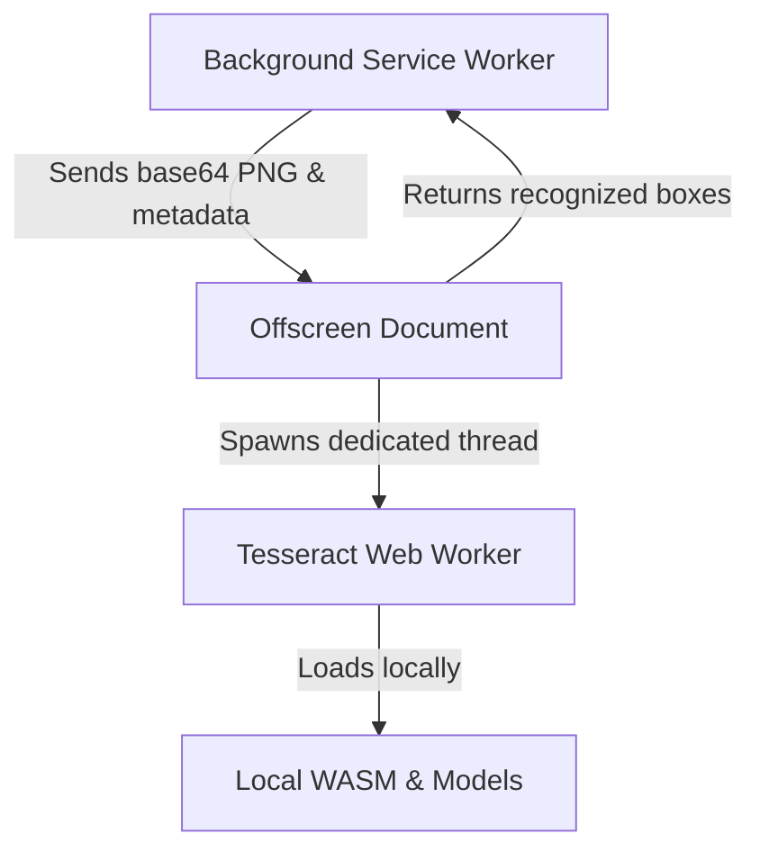

# MangaLens — Milestone 4C: Local OCR and Accurate Text Overlay Placement

MangaLens is a Chrome Manifest V3 prototype for manga, manhwa, and webtoon translation experiences. Milestone 4C replaces the template-based mockup coordinates with a **real local OCR character recognition engine** running entirely client-side. It does not implement real translation yet (translated text is set equal to original text).

---

## Local OCR Architecture



1. **Background Service Worker**:
   - Coordinates the capture process, manages operation sequencing, and controls tab lifecycle.
   - Enforces a unified execution deadline for each scan tab.
   - Converts the captured PNG `Blob` to a memory-only base64 data-URL string and routes it to the offscreen page via `chrome.runtime.sendMessage`.

2. **Offscreen Document**:
   - Compiled from `entrypoints/offscreen.html` and `lib/translation/offscreen.ts`.
   - Runs in a separate, dedicated extension origin context, allowing DOM canvas processing (`OffscreenCanvas`), pixel contrast binarization (Connected Component Analysis), text box cropping, and local worker spawning without violating Manifest V3 restrictions.

3. **Tesseract Web Worker**:
   - The offscreen document uses `Tesseract.createWorker` to spawn a dedicated Web Worker (`new Worker()`) running the compiled WebAssembly OCR engine.
   - Standard, SIMD, LSTM, and SIMD-LSTM WebAssembly cores are loaded locally depending on browser capabilities.

4. **Offscreen Lifecycle Management**:
   - The background service worker tracks the active scan requests count.
   - The offscreen document context is created on the first active scan and kept alive as long as `activeScansCount > 0`.
   - Once all scans finish (either successfully, failing, aborting, or timing out), the background page invokes `chrome.offscreen.closeDocument()` to release all resources.
   - If a new request arrives while a previous document closure is pending, the initialization queues and awaits the closure promise to complete, avoiding Chrome MV3 document collision races.

5. **Wasm in Manifest V3 (CSP)**:
   - WXT manifest configuration defines a strict Content Security Policy allowing WebAssembly execution within the extension context:
     ```json
     "content_security_policy": {
       "extension_pages": "script-src 'self' 'wasm-unsafe-eval'; object-src 'self';"
     }
     ```
   - No assets are exposed in `web_accessible_resources`, preventing external website fingerprinting.

---

## Local Asset Storage & Bundle Impact

All Tesseract JS, WASM, and language assets are stored locally under the `public/tesseract/` directory:

- **Library Core**: `public/tesseract/tesseract.esm.min.js` (67 kB)
- **Web Worker**: `public/tesseract/worker.min.js` (124 kB)
- **WASM Cores**:
  - Standard LSTM Core: `tesseract-core-lstm.wasm.js` (3.94 MB) & `tesseract-core-lstm.wasm` (2.86 MB)
  - SIMD LSTM Core: `tesseract-core-simd-lstm.wasm.js` (3.94 MB) & `tesseract-core-simd-lstm.wasm` (2.86 MB)
  - Standard non-LSTM Core: `tesseract-core.wasm.js` (4.73 MB) & `tesseract-core.wasm` (3.46 MB)
  - SIMD non-LSTM Core: `tesseract-core-simd.wasm.js` (4.74 MB) & `tesseract-core-simd.wasm` (3.46 MB)
- **Language Models**: Stored under `public/tesseract/lang/` using optimized `tessdata_fast` weights:
  - English (`eng.traineddata` — 4.11 MB)
  - Japanese (`jpn.traineddata` — 2.47 MB & `jpn_vert.traineddata` — 3.04 MB)
  - Korean (`kor.traineddata` — 1.68 MB)
  - Chinese Simplified (`chi_sim.traineddata` — 2.47 MB)

**Total Extension Bundle Size**: Approximately **44.36 MB**.

---

## Timeouts & Safeguards

- **Unified Deadline**: The complete local OCR operation operates under a single **28-second deadline**.
- **Timing Allocations**: Each step (worker initialization and individual recognition crop loops) consumes the *remaining time* of the total deadline rather than receiving fresh allowances.
- **Late Worker Termination**: If a cancellation (abort or timeout) is triggered while worker initialization is pending, a callback observer ensures that when the promise eventually resolves in the background, `worker.terminate()` is called immediately to prevent thread leaks.

---

## Testing Local OCR

### Automated Tests
Verify all coordinate bounds, CCA binarization, reading order sorting, concurrency locks, timeout deadlines, and late worker termination:

```bash
pnpm install --frozen-lockfile
pnpm compile
pnpm test
pnpm build
```

### Manual Steps in Google Chrome
1. Start the capture fixture server:
   ```bash
   pnpm fixture
   ```
2. Build the extension:
   ```bash
   pnpm build
   ```
3. Load the unpacked extension from `.output/chrome-mv3` in Google Chrome.
4. Open the fixture page (`http://127.0.0.1:4173/`).
5. Trigger translation via the extension and verify local OCR placements.
